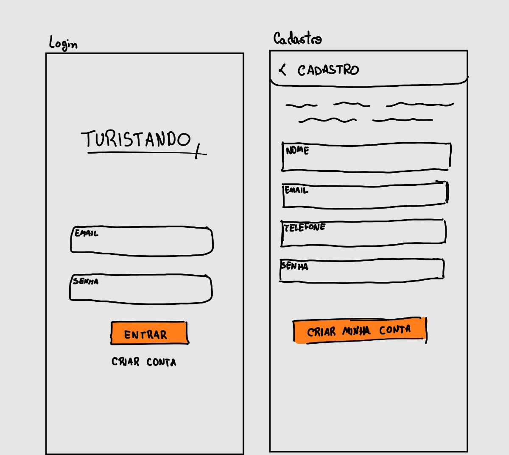
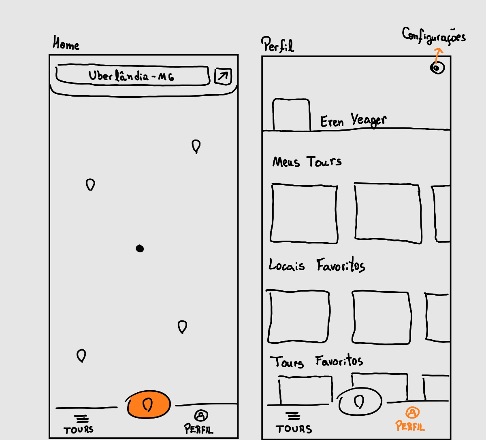
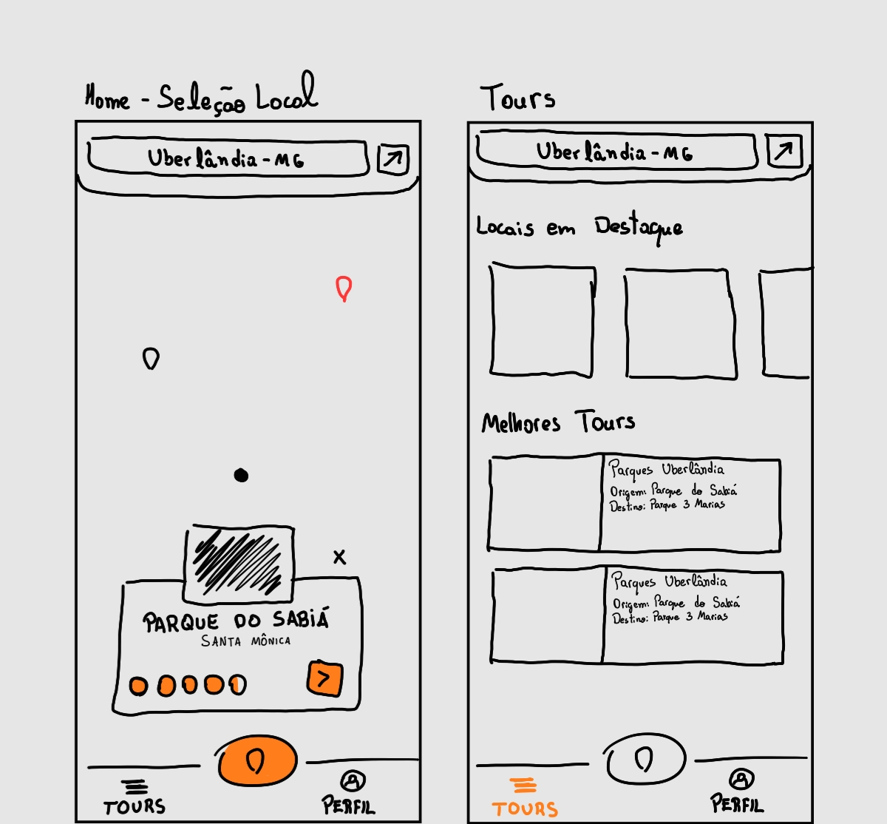
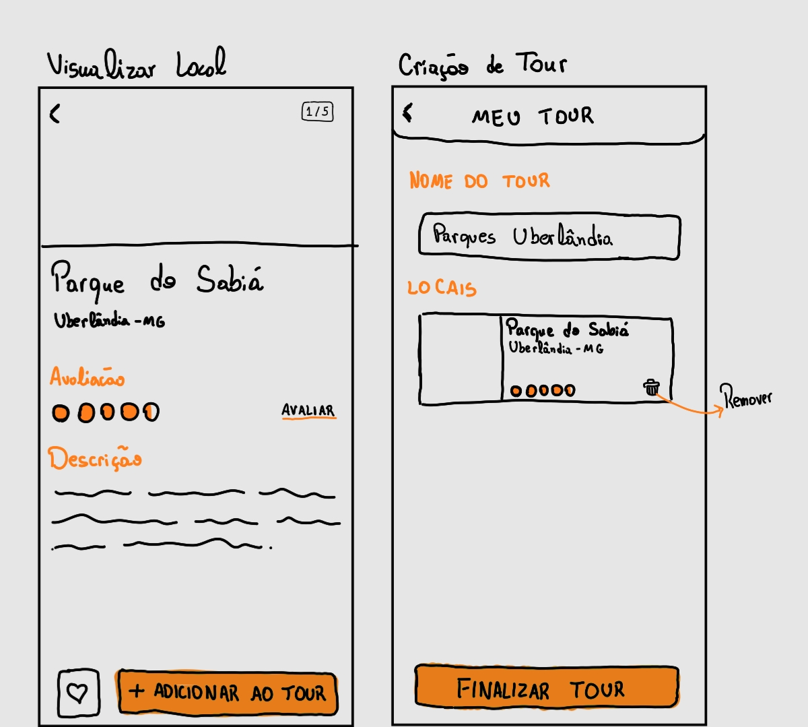
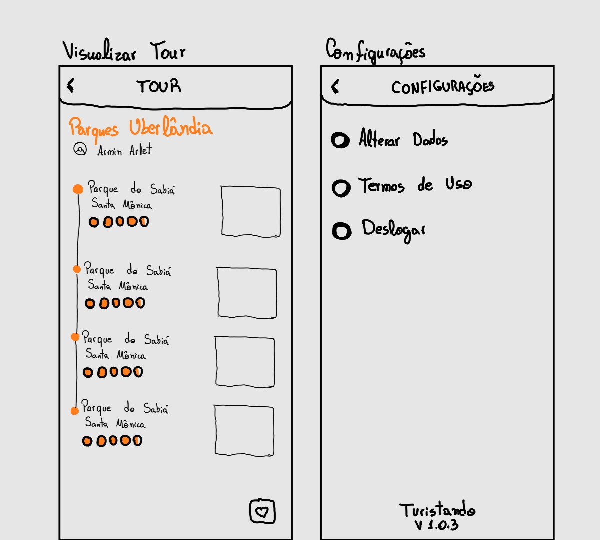
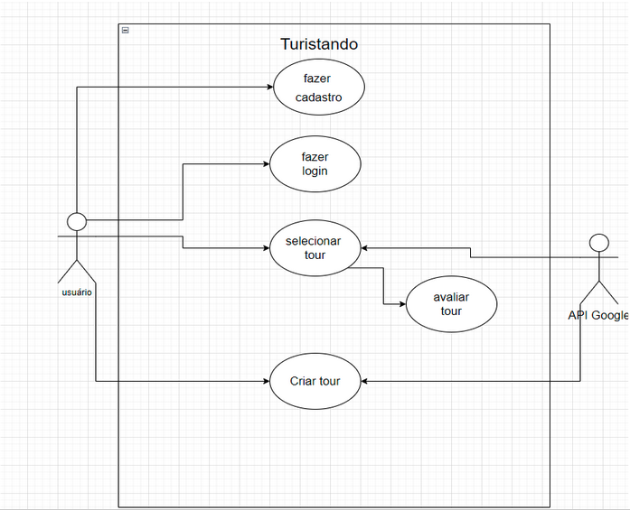

# Trabalho de Engenharia de Software - Turistando
**Sistema de Agregação de Pontos Turísticos baseado em Localização**

Alunos: 
  - Bruno Oliveira Sinhoroto
  - Davi Augusto Silva
  - Gustavo Vinícius Alba
  - Marcelo Junio
  - Otávio Almeida Leite
  - Paulo Kiyoshi Oyama Filho

## Concepção do Sistema
O Turistando é um aplicativo de visualização de pontos turísticos e planejamento de viagens.

Por meio dele, os usuários podem ver em um mapa os pontos turísticos e sua localização para montar um tour a se fazer por eles.
Nisso, os tours criados por usuário se tornam públicos para que qualquer outro usuário possa visualizá-lo.

<html>
  

    
    
  

  

    
    
  

  
</html>

## Diferencial Competitivo
Como principal diferencial o Turistando possui a personalização de tours turísticos que podem ser feitos por qualquer um , podendo assim incluir viajantes experientes ou nativos da região, dispensando um guia turístico uma vez que a rota já estará pronta através do GPS, eliminado o custo do guia e de um planejamento turístico.

O Turistando também possuirá um sistema de gamificação que beneficiará aqueles que criarem os melhores tours dentro do app , incentivando assim tours mais bem elaborados ou desejados pela comunidade. 

## Definição do Ferramental a ser Utilizado
- Front-end mobile: Linguagem Dart com Framework Flutter
- Back-end: Linguagem Python com Framework FastAPI
- Banco de Dados: PostgreSQL
- Versionamento: Git com GitHub
- Organização e Planejamento do Projeto: Notion
- Prototipação de Interface: Figma
- Criação de Diagramas: Diagrams.net, dbdiagram.io

## Requisitos Preliminares do Sistema

- O app deve pegar a localização atual do usuário(apenas a nível de qual cidade).
- Deve ser possível visualizar locais em uma determinada região.
- O usuário precisará criar uma conta para utilizar o app.
- Na criação da conta, será necessário: nome, e-mail, telefone e senha.
- O usuário poderá criar listas de lugares(tours), que serão visíveis para outros usuários.
- A aplicação deverá rodar em smartphones Android e iOS.

## Especificiação dos Casos de Uso
### Caso de uso : fazer cadastro
Atores : Usuário
- Caso de sucesso:
  1. Usuário preenche campos de nome , email, senha e telefone 
  2. Sistema salva dados
- Extensão:
  1. E-mail já registrado no banco
    Mensagem de usuário já cadastrado
  2. Falha no registro dos dados
    Usuário re-insere os dados

### Caso de uso: Fazer login
Atores : Usuário
- Caso de sucesso:
  1. Usuário insere dados de login
- Extensão:
  1. Caso usuário não cadastrado
    Mensagem de e-mail não cadastrado
  2. Caso e-mail ou senha inválidos
    Mensagem de dados incorretos

### Caso de uso : Selecionar tour
Atores: Usuário , API Google
- Caso de sucesso:
  1. Usuário ativa a localização no aparelho
  2. Usuário Seleciona um local no mapa
  3. API Google faz requisição ao maps
  4. Usuário escolhe um tour da região
- Extensão:
  1. Falha ao ativar a localização
    Permitir que o app possa usar o serviço de GPS através das configurações
  2. Falha ao Selecionar um local
    Exibir mensagem “Local Não Disponível ou sem Tour”
  3. Falha na requisição da API
    Sistema solicita no requisição
  4. Falha ao escolher o Tour
    Tour nao mais disponível ou em processo de mudança

## Planejamento

O planejamento está sendo feito no Notion e pode ser visualizado pelo seguinte link:

[Notion - Engenharia de Software](https://gainful-suede-bbf.notion.site/Engenharia-de-Software-9e9a768c8efa48bbadb0fed14512f972)